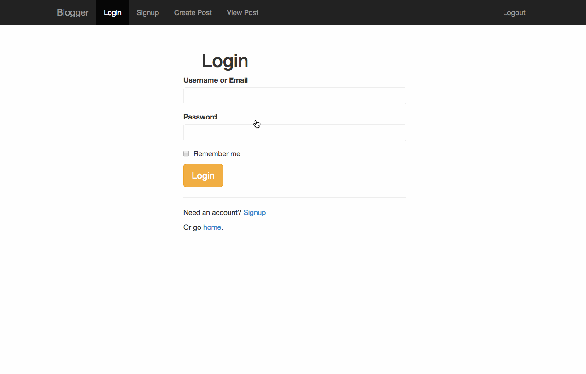

## Blogger

This is a basic Blogger clone to create a blog with comments.

Time spent: `30h`

### Features

#### Required

- [x] User can Signup, Login and Logout with input validation
- [x] Session and user accounts are persisted in a data store
- [x] User can create and edit a blog post
- [x] User can view blog posts with details on their Profile
- [x] User can comments on their blog posts on their Profile
- [x] User can view a anyone's blog with posts and comments at the specified url
- [x] Logged In users can comment on any blog post

### Optional

- [x] User can specify a vanity url for their blog
- [x] User's passwords are secured additionally with a blacklist, salt and pepper
- [x] User can click "Remember Me" to remain logged in
- [x] Users can author blog posts with rich text
- [x] Clicking a blog tag redirects to a list of blogs and blog posts with the given tag
- [x] Users can include image(s) to be displayed on their blog post
- [x] Users can specify a future release date and time to make a blog post visible
- [x] Users can rate blog posts, and authors can view the aggregate rating
- [x] Users can upvote/downvote comments when logged in
- [x] Users can edit their comments
- [x] Public user profiles show their information, posts and comments

### Walkthrough

